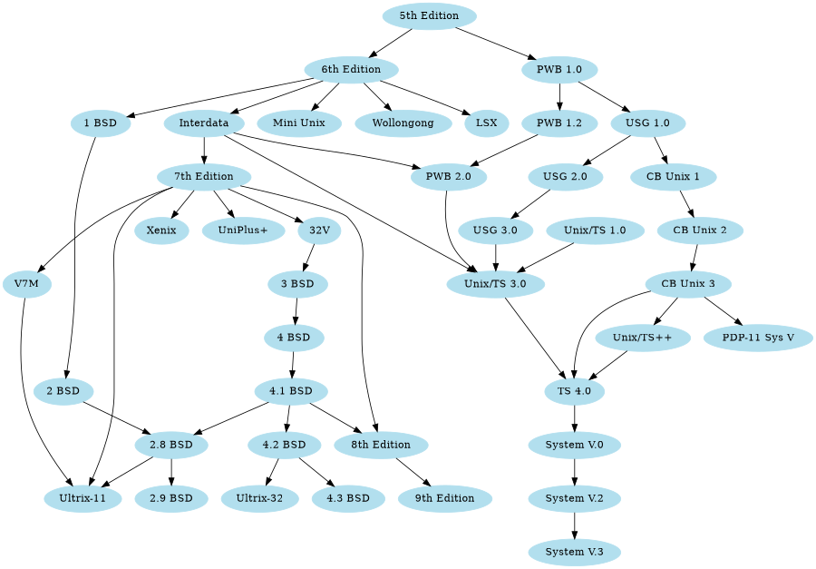

# Description

* Based on [hugo-book](https://github.com/alex-shpak/hugo-book)
* Markdown
* Menu over files tree
* Content search
* Table of content
* Print content button
* Copy to clipboard code snippets and [Fira Code](https://github.com/tonsky/FiraCode) font.
* Graphs, katex, expand/collapse, columns, tabs.

# Markdown

### Text
It's very easy to make some words **bold** and other words *italic* with Markdown. You can even [link to Google!](http://google.com)

Also, below you can see splitter:

---

### List

Sometimes you want numbered lists:

1. One
2. Two
3. Three

Sometimes you want bullet points:

* Start a line with a star
* Profit!

Alternatively,

- Dashes work just as well
- And if you have sub points, put two spaces before the dash or star:
  - Like this
  - And this

If you include a task list in the first comment of an Issue, you will get a handy progress indicator in your issue list. It also works in Pull Requests!

- [x]  **formatting**, [links](#list), and <del>tags</del> supported
- [x] list syntax required (any unordered or ordered list supported)
- [x] this is a complete item
- [ ] this is an incomplete item

### Image
If you want to embed images, this is how you do it:


### Headers

# H1
## H2
### H3
H3, H4, H5 and H6 is not available in table of content! But you still can share links.
#### H4
##### H5
###### H6

### quote
If you'd like to quote someone, use the > character before the line:

> Coffee. The finest organic suspension ever devised... I beat the Borg with it.  
> - Captain Janeway

### Code

This is `inline` code.

Code blocks.
There is also `copy to clipboard` button. It copies all content of code snippet to clipboard.

    public class MineSweeper
    {	private int[][] myTruth;
        private boolean[][] myShow;
        
        public void cellPicked(int row, int col)
        {	if( inBounds(row, col) && !myShow[row][col] )
            {	myShow[row][col] = true;
            
                if( myTruth[row][col] == 0)
                {	for(int r = -1; r <= 1; r++)
                        for(int c = -1; c <= 1; c++)
                            cellPicked(row + r, col + c);
                }	
            }
        }
        
        public boolean inBounds(int row, int col)
        {	return 0 <= row && row < myTruth.length && 0 <= col && col < myTruth[0].length;
        }
    }
    
Block with language highlighting:

```java
public class MineSweeper
{	private int[][] myTruth;
	private boolean[][] myShow;
	
	public void cellPicked(int row, int col)
	{	if( inBounds(row, col) && !myShow[row][col] )
		{	myShow[row][col] = true;
		
			if( myTruth[row][col] == 0)
			{	for(int r = -1; r <= 1; r++)
					for(int c = -1; c <= 1; c++)
						cellPicked(row + r, col + c);
			}	
		}
	}
	
	public boolean inBounds(int row, int col)
	{	return 0 <= row && row < myTruth.length && 0 <= col && col < myTruth[0].length;
	}
}
```

# Другие языки
У лукоморья дуб зелёный;  
Златая цепь на дубе том:  
И днём и ночью кот учёный  
Всё ходит по цепи кругом;  
Идёт направо — песнь заводит,  
Налево — сказку говорит.  
Там чудеса: там леший бродит,  
Русалка на ветвях сидит;  
Там на неведомых дорожках  
Следы невиданных зверей;  
Избушка там на курьих ножках  
Стоит без окон, без дверей;  
Там лес и дол видений полны;  
Там о заре прихлынут волны  
На брег песчаный и пустой,  
И тридцать витязей прекрасных  
Чредой из вод выходят ясных,  
И с ними дядька их морской;  
Там королевич мимоходом  
Пленяет грозного царя;  
Там в облаках перед народом  
Через леса, через моря  
Колдун несёт богатыря;  
В темнице там царевна тужит,  
А бурый волк ей верно служит;  
Там ступа с Бабою Ягой  
Идёт, бредёт сама собой,  
Там царь Кащей над златом чахнет;  
Там русский дух… там Русью пахнет!  
И там я был, и мёд я пил;  
У моря видел дуб зелёный;  
Под ним сидел, и кот учёный  
Свои мне сказки говорил.  

# Shortcodes

## Columns


## Astris ipse furtiva

Est in vagis et Pittheus tu arge accipiter regia iram vocatur nurus. Omnes ut
olivae sensit **arma sorori** deducit, inesset **crudus**, ego vetuere aliis,
modo arsit? Utinam rapta fiducia valuere litora _adicit cursu_, ad facies

<--->

## Suis quot vota

Ea _furtique_ risere fratres edidit terrae magis. Colla tam mihi tenebat:
miseram excita suadent es pecudes iam. Concilio _quam_ velatus posset ait quod
nunc! Fragosis suae dextra geruntur functus vulgata.

<--->

Lorem **markdownum** emicat gestu. Cannis sol pressit ducta. **Est** Idaei,
tremens ausim se tutaeque, illi ulnis hausit, sed, lumina cutem. Quae avis
sequens!


## Buttons

Get Home
Google

## Expand


### Markdown content
Lorem markdownum insigne...


## Hints


**Markdown content**  
Lorem markdownum insigne. Olympo signis Delphis! Retexi Nereius nova develat
stringit, frustra Saturnius uteroque inter! Oculis non ritibus Telethusa



**Markdown content**  
Lorem markdownum insigne. Olympo signis Delphis! Retexi Nereius nova develat
stringit, frustra Saturnius uteroque inter! Oculis non ritibus Telethusa



**Markdown content**  
Lorem markdownum insigne. Olympo signis Delphis! Retexi Nereius nova develat
stringit, frustra Saturnius uteroque inter! Oculis non ritibus Telethusa


## Graphviz

You can draw graphs via graphviz or mermaid.


### Graphviz


<--->

### Mermaid


sequenceDiagram
    Alice->>Bob: Hello Bob, how are you?
    alt is sick
        Bob->>Alice: Not so good :(
    else is well
        Bob->>Alice: Feeling fresh like a daisy
    end
    opt Extra response
        Bob->>Alice: Thanks for asking
    end




## Tabs




### MacOS

This is tab **MacOS** content.

Lorem markdownum insigne. Olympo signis Delphis! Retexi Nereius nova develat
stringit, frustra Saturnius uteroque inter! Oculis non ritibus Telethusa
protulit, sed sed aere valvis inhaesuro Pallas animam: qui _quid_, ignes.
Miseratus fonte Ditis conubia.




### Linux

This is tab **Linux** content.

Lorem markdownum insigne. Olympo signis Delphis! Retexi Nereius nova develat
stringit, frustra Saturnius uteroque inter! Oculis non ritibus Telethusa
protulit, sed sed aere valvis inhaesuro Pallas animam: qui _quid_, ignes.
Miseratus fonte Ditis conubia.




### Windows

This is tab **Windows** content.

Lorem markdownum insigne. Olympo signis Delphis! Retexi Nereius nova develat
stringit, frustra Saturnius uteroque inter! Oculis non ritibus Telethusa
protulit, sed sed aere valvis inhaesuro Pallas animam: qui _quid_, ignes.
Miseratus fonte Ditis conubia.



## Katex


x = \begin{cases}
   a &\text{if } b \\
   c &\text{if } d
\end{cases}

