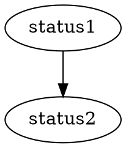

# Graphviz

Use code block with language `graphviz` to render dot graphs.
Check out documentation at [official site graphviz.org](https://graphviz.org).
## Example

```tpl
digraph G {
    status1->status2;
}
```

